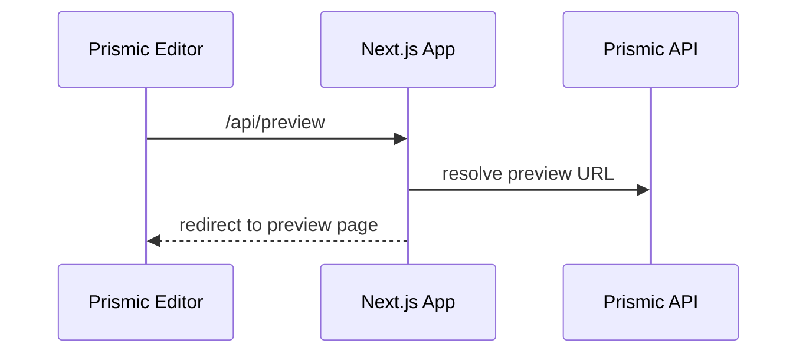

# Configuration Guide

This doc verifies the current setup and explains how to configure local, Prismic, GitHub, and Vercel for this project.

## Current Status Check

- Local dev: `next dev` on port 3000 with Slice Machine on its default port (via `npm run dev`).
- Prismic repo: `request` configured in [prismic-next/slicemachine.config.json](../slicemachine.config.json).
- Preview: endpoints are present at `/api/preview` and `/api/exit-preview`.
- Revalidate: endpoint at `/api/revalidate` with optional header `x-prismic-webhook-secret`.
- Vercel: no `vercel.json` present. Config handled in Vercel UI.
- GitHub: no CI or preview config files in this repo.

## App Root

- The active Next.js app lives in `prismic-next/`.
- The legacy static site at repo root is not used for Prismic.

## What Vercel Does

- Builds and hosts the Next.js app.
- Creates preview deployments for pull requests (when connected to GitHub).
- Provides the public URL used by Prismic previews and webhooks.

## Required Environment Variables

Create `prismic-next/.env` from `prismic-next/.env.example`:

- `NEXT_PUBLIC_PRISMIC_REPOSITORY_NAME` - repo subdomain, e.g. `request`.
- `PRISMIC_ACCESS_TOKEN` - only if repo is private or for environments.
- `PRISMIC_WEBHOOK_SECRET` - optional; if set, webhook must send `x-prismic-webhook-secret`.

## Local Development

```bash
cd prismic-next
npm install
npm run dev
npm run health
```

- App: http://localhost:3000
- Slice Simulator: http://localhost:3000/slice-simulator

## Prismic Dashboard Setup

1) Previews

- Add preview URL: `http://localhost:3000/api/preview`
- Add preview URL: `https://request-beryl.vercel.app/api/preview`

Previews must point to the Next.js app domain. Do not use `request.prismic.io` or `/slice-simulator` for previews.

2) Webhook

- URL: `https://request-beryl.vercel.app/api/revalidate`
- Method: `POST`
- Header: `x-prismic-webhook-secret: <PRISMIC_WEBHOOK_SECRET>` (if set)

## GitHub Setup (Recommended)

- Connect your GitHub repo to Vercel for preview deployments.
- Use the default branch `main` for production, PRs for previews.

## Vercel Setup (Recommended)

Project Settings:

- Framework: Next.js
- Root Directory: `prismic-next`
- Build Command: `npm run build`
- Output Directory: `.next`
- Environment Variables: copy from `prismic-next/.env`

## Verification Steps

```bash
cd prismic-next
npm install
npm run dev
```

Manual checks:

- Open http://localhost:3000 (home page should render or show the Prismic placeholder).
- Open http://localhost:3000/slice-simulator (Slice Simulator loads).
- Trigger preview from Prismic (redirects to a draft page).
- Publish a document and verify `/api/revalidate` is called.

## Content Models

### Custom Types

- `page` (repeatable)
- `imprint` (single)
- `privacy_policy` (single)
- `site_settings` (single)

### Slice Library

- `hero`
- `features_grid`
- `cta_banner`
- `full_screen_section`
- `rich_text`
- `footer`

## Architecture Diagram

```mermaid
flowchart LR
  Editor[Prismic Editor] -->|Publish| Prismic[Prismic API]
  Prismic -->|Fetch| NextApp[Next.js App]
  NextApp -->|Render| Browser[Client Browser]
  Prismic -->|Webhook| Revalidate[/api/revalidate/]
  Revalidate -->|revalidateTag(prismic)| NextCache[Next.js Cache]
  GitHub[GitHub Repo] -->|Deploy| Vercel[Vercel]
  Vercel -->|Serve| NextApp
```

## Preview Flow



## Checklist

- [ ] Set `.env` values
- [ ] Configure previews in Prismic
- [ ] Configure webhook in Prismic
- [ ] Connect GitHub to Vercel
- [ ] Deploy and add production preview URL
